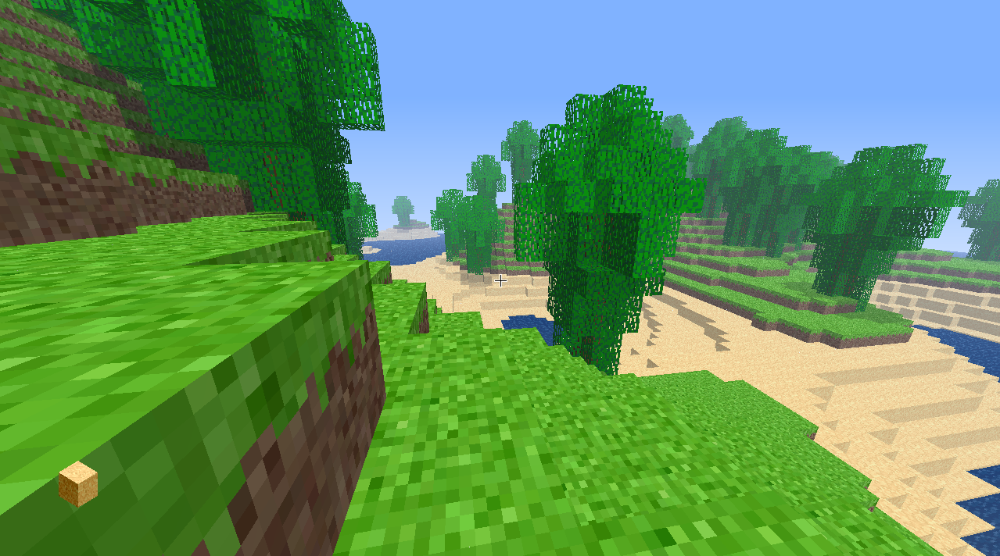

# CleveLand: Minecraft-inspired procedural voxel game in C++

### By Jackson Levine

# Known bugs:

Category: World generation/loading. All would be solved by faster block/chunk query/remeshing algorithm.

  - Blocks placed by user are not always instantly displayed.

  - Time to transition from main menu/world select menu to loading in the world is too long / World loads in a little too slowly

Category: Usability / Playability

- Collisions with blocks being slightly iffy when jumping up/around corners

## Dependencies:
## Using C++, OpenGL, and EnTT

### GLFW
### GLEW
### GLM
### EnTT
### Boost

### Only supporting Windows at this time. Also is only tested with MSVC compiler, cannot guarantee other compilers or toolchains will work.

# Recommended setup (Windows)

1. Follow instructions here to set up Vcpkg: https://github.com/microsoft/vcpkg

2. Run the following commands within your /vcpkg folder to get the dependencies needed for this project:

`./vcpkg.exe install glfw3:x64-windows-static`

`./vcpkg.exe install glew:x64-windows-static`

`./vcpkg.exe install glm:x64-windows-static`

`./vcpkg.exe install entt:x64-windows-static`

`./vcpkg.exe install boost:x64-windows-static`

3. In makefile.bat, this points to the directory of vcpkg assuming it's in (home)/Documents/vcpkg:

`-DCMAKE_TOOLCHAIN_FILE=~/Documents/vcpkg/scripts/buildsystems/vcpkg.cmake`

If your vcpkg folder is not in Documents, change the beginning of that path (the part leading up to /vcpkg) to point to where you installed vcpkg.

4. Run makefile.bat. It will likely complain that ResourceHacker.exe does not exist, ignore that as it is only for changing the .exe icon.

5. Launch main.exe or run run.bat.
